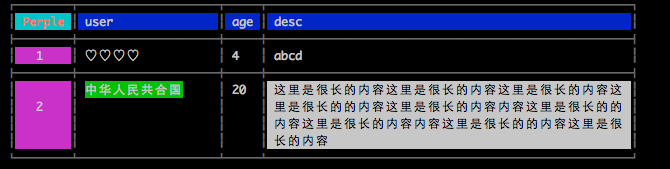

# tty-wrap

在终端上截断文字，支持[East Asian Width（包括了中文）](http://unicode.org/reports/tr11/)、[Combining Marks](https://mathiasbynens.be/notes/javascript-unicode#accounting-for-other-combining-marks)、以及 [Surrogate Pairs](https://mathiasbynens.be/notes/javascript-encoding#surrogate-pairs)





>
> 背景：在 JS 中，一个中文的长度是 2，即 `'中'.length === 2`，在命令行上，它应该占两列；所以，如果对中文进行 wrap 时很容易出错。
> 老外写的很多命令行上的组件对中文都不友好，导致输出的格式比较乱，比如使用 `[yargs](https://github.com/bcoe/yargs)` 并开启 `wrap` 模式时，输出的 help 文档很难看；
> 另外，不仅仅中文的长度是 2 比较特殊，还有很多字符的长度是 0，甚至还有些字符是根据环境的不同而变化长度。
> 此工具尽量帮你处理不同长度的字符，把它转化成命令行上的列数，方便进行手动截断处理
>
> 依赖于我写的另一个工具 [tty-text](https://github.com/qiu8310/tty-text) 。
>


**已知问题：**

* border 中的 `single` 和 `dobule` 使用的字符都是 Ambiguous 字符，所以在某些系统上看上去边框会过宽，所以尽量使用 `simple` 的边框

* 如果 text 内容中使用了 Ambiguous 字符的话，建议在程序最后执行 `wrap.detectSize()`，它会检查当前终端的 Ambiguous 字符的宽度，并缓存下来，下次使用时直接用缓存的，所以第一次看上去不正常，但下一次就正常了，并且 `detectSize` 每个月才会运行一次。但如果你没使用 Ambiguous 字符，则无需这么麻烦。**另外我在寻找一个更好的方法可以直接获取当前终端上的 Ambiguous 字符的大小，而不要找这个弯路**


## Usage


```js

wrap.table(
  [
    {age: 4, user: '\u2661 \u2661 \u2661 \u2661', desc: 'abcd'},
    {age: 20, user: chalk.bgGreen('中华人民共合国'), desc: '这里是很长的内容这里是很长的内容这里是很长的内容这里是很长的的内容这里是很长的内容内容这里是很长的的内容这里是很长的内容内容这里是很长的的内容这里是很长的内容'}
  ],

  {
    left: 10,
    showHead: true,
    showLead: true,
    leadHead: 'Perple',
    lead: ['1', '2'],
    showLeadOnRight: false,
    border: 'single',
    colSort: ['user', 'age', 'desc'],
  },

  {
    colB: {
      paddingRight: 5,
    },
    rowA: {
      color: 'bgBlue'
    },
    colA: {
      color: 'bgMagenta',
      align: 'center',
      vertical: 'middle'
    },
    cellAA: {
      color: 'red.bold.bgCyan'
    },
    cellLastALastA: {
      width: 50,
      color: 'bgWhite.black'
    }
  }
)
```


## API

### 直接导出下下面的变量

**模块**

- `tt`: `tty-text` 模块
- `ts`: `tty-size` 模块
- `chalk`: `chalk` 模块

**ANSI常量**

- `ANSI_REGEXP`
- `REST_SRG`
- `CSI`
- `ESC`


### wrap.table(data, opts, style);

利用 `data` 中的数据生成表格

**`data`**: 可以是一个二维数组，或者二维对象，或者它们的组合


**`opts`**: 属性配置


|   参数             |  类型           |   描述                           |
| ----------------  | --------------- | ----------------------------    | 
| head              | {Array}         |  自定义表头，如果指定了，showHead 默认为 true    | 
|  lead             | {Array}         |  自定义表左边的索引，如果指定了， showLead 默认为 true    | 
|  leadHead         | {String}        |  左上角的那一个 cell 中的字符串，默认是空    | 
|  showHead         | {Boolean}       |  是否显示表头    | 
|  showLead         | {Boolean}       |  是否显示表索引    | 
|  showHeadOnBottom | {Boolean}       |  是否将表头放在未尾    | 
|  showLeadOnRight  | {Boolean}       |  是否将表索引放在右边    | 
|  border           | {String|Object} |  是否显示边框，默认不显示，可以设置成 `single` 或 `double` 或具体的字符，参考 [cli-table](https://github.com/Automattic/cli-table)    | 
|  borderColor      | {String}        |  边框样式    | 
|  rowFilter        | {Array|Function}|  行过滤    | 
|  colFilter        | {Array|Function}|  列过滤    | 
|  rowSort          | {Array|Function}|  行排序    | 
|  colSort          | {Array|Function}|  列排序    | 
|  left             | {Number|String} |  向左缩进，比如: 3, '%10'    | 
|  right            | {Number|String} |  向右缩进     | 
|  width            | {Number|String} |  指定表格整体的宽度     | 
|  autoWrapOnCol    | {String}        |  如果限定了 width 或 right，则必须有一列是可以自动申缩的，用此参数指定，没指定默认取最后一列  | 
|  console          | {String|Boolean}|  是否输出生成的内容，如果输出并可以指定要使用的 console 中的方法 |


 *   - left:          {Number|String}    整数或者百分比（相对当前屏幕），如: 2, '20%'
 *   - right:         {Number}
 *   - width:         {Number}
 *   - autoWrapOnCol: {String}           
 *   - console        {String|Boolean}   是否输出生成的内容，如果输出并可以指定要使用的 console 中的方法
 *

 **`style`**: 样式配置

* color: 指定颜色，可以串连起来，如 `'red.bgGreen'`，使用的是 `chalk` 的关键字
* padding: 类似于 CSS 的 padding，可以设置成 `'0 1'`，即表示左右各空一列 
* paddingLeft/paddingRight/paddingBottom/paddingTop: 此中的值会覆盖具体的 padding
* ellipsis: 如果 cell 放不下，就会用到此处指定的字符串，默认是 `' ...'`
* align: 左右对齐，可以指定为 `left, right, center`
* vertical: 上下对齐，可以指定为 `top, bottom, middle`
* width/height: 指定宽高（只会作用在 cell 上）

**另外可以指定某一行或某一列或某个 cell 的样式，通过下面的组合，注意，越下优先级越高**

* row/col
* oddRow/oddCol/evenRow/evenCol/
* rowA/rowB/...rowZ, colA/colB/...colZ
* rowLastA/rowLastB..., colLastA...
* head/lead
* cellAA/cellAB
* cellLastAA/cellLastALastB/...


### wrap.cell(text, opts);

将文本 wrap 到指定的一个区域内，内部调用了 `wrap` 函数

**`text`**: 要处理的字符串

**`opts`** 配置项，支持下面的值

 * left - 到屏幕左侧的距离
 * right - 到屏幕右侧的距离
 * width - 区块的宽度（0表示不限制） **注意 left + right + width 不能超过当前屏幕的宽度**
 * height - 区块的高度（0表示不限制）
 * tabsize - 参见 `wrap` 函数中的定义
 * ambsize - 参见 `wrap` 函数中的定义
 * ellipsis - 参见 `wrap` 函数中的定义
 * inheritColor - 参见 `wrap` 函数中的定义
 * fill - 参见 `wrap` 函数中的定义


### wrap(text, opts);

底层的一个函数， `wrap.table` 和 `wrap.cell` 都依赖了它

**`text`**: 要处理的字符串

**`opts`** 配置项，支持下面的值

   参数            |  类型    |   描述
 ---------------- |----------|----------------------------------- 
  width           | {Number} | 限制字符串宽度（默认为 0， 不限制）      
  height          | {Number} | 限制字符串的高度（默认为 0，不限制）     
  tabsize         | {Number} | 指定 \t 的大小，（默认是 8）           
  ambsize         | {Number} | 指定 ambiguous character width ，（默认是 1，可选值是 1、2） 
  prefix          | {String} | 在每行添加一个前缀  
  fill            | {Boolean}| 是否要填平空白的区域  
  inheritColor    | {Boolean}| 是否要继承上一行的颜色 
  ellipsis        | {String} | 如果超出了宽度和高度就在最后加上此字段（默认为 ' ...'） 
  

**返回值**
  
  `{text:String, col:Number, row:Number}`


## Examples

* [`wrap.cell` example](./examples/cell-example.js);
* [`wrap.tabel` example](./examples/table-example.js);


## Knowledge

* East Asian Width [文档](http://unicode.org/reports/tr11/) [数据](http://www.unicode.org/Public/UCD/latest/ucd/EastAsianWidth.txt)
* [ANSI escape code](https://en.wikipedia.org/wiki/ANSI_escape_code)
* [ASCII 控制字符](https://en.wikipedia.org/wiki/C0_and_C1_control_codes)
* [JavaScript Unicode](https://mathiasbynens.be/notes/javascript-unicode#accounting-for-other-combining-marks)


## CSI Codes

**结构**

```
CSI [private mode character(s?)] n1 ; n2... [trailing intermediate character(s?)] letter
```


## Terminology

* **CSI** - Control Sequence Introducer (or Control Sequence Initiator)
* **SGR** - Select Graphic Rendition


